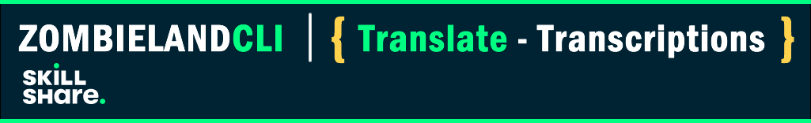
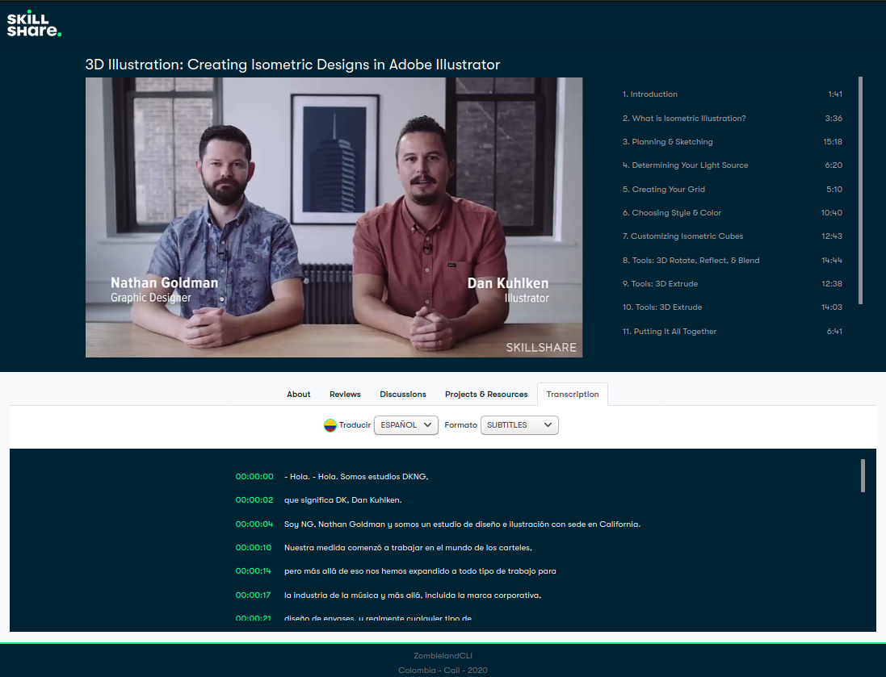

# Translate-Transcriptions Project for Skillshare

Internationalization has been a big part of our goals for this year, and we want to get closer to that objective by allowing users to see the video transcripts in their native language.
We already support transcript in English for all our Original classes, we are looking to implement a solution that would allow users to auto-translate these transcripts into the language of their choosing.

## Content

1. Documentation

- [Back-End](01_backend_code/)

- [API Gateway](04_apigw/)

- [Front-End](03_frontend_code/)

- [Back-ups](99_backups/)

## Authors

* **Carlos Andres Garcia Morales** - [Github](https://github.com/agzsoftsi) - [Twitter](https://twitter.com/karlgarmor)
* **Ivan Dario Lasso Gil** - [Github](https://github.com/ilasso) - [Twitter](https://twitter.com/ilasso)
* **Leonardo Calderon Jaramillo** - [Github](https://github.com/leocjj) - [Twitter](https://twitter.com/leocj)
